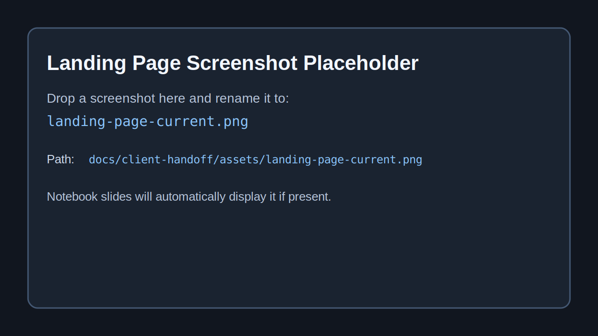
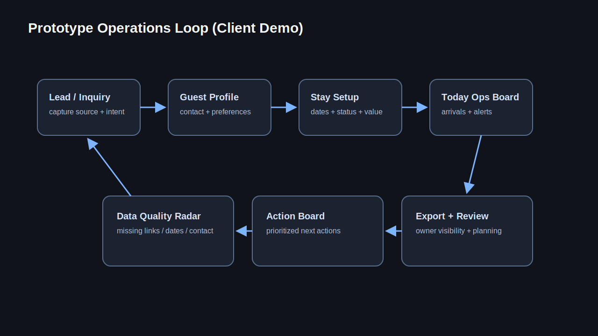
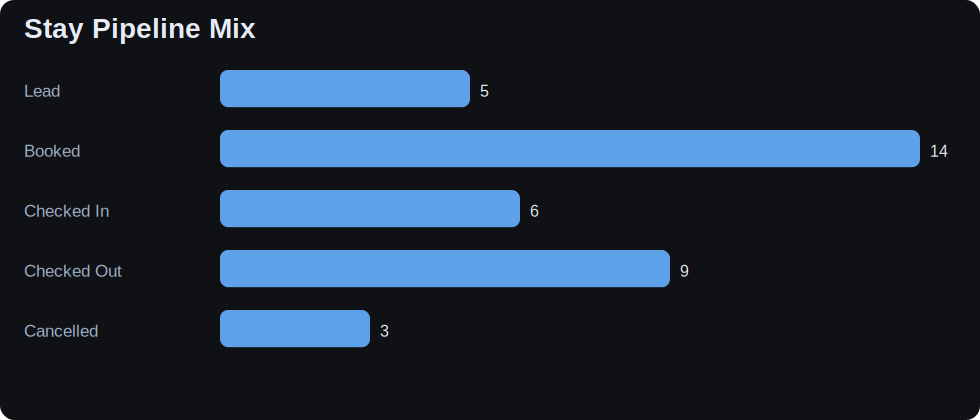
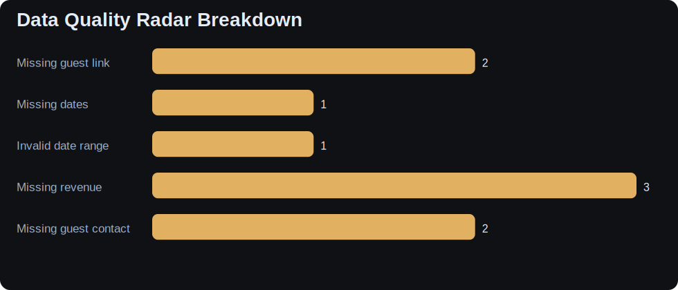
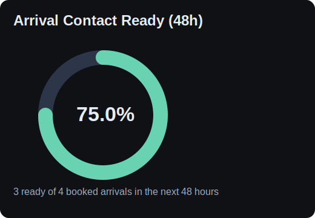
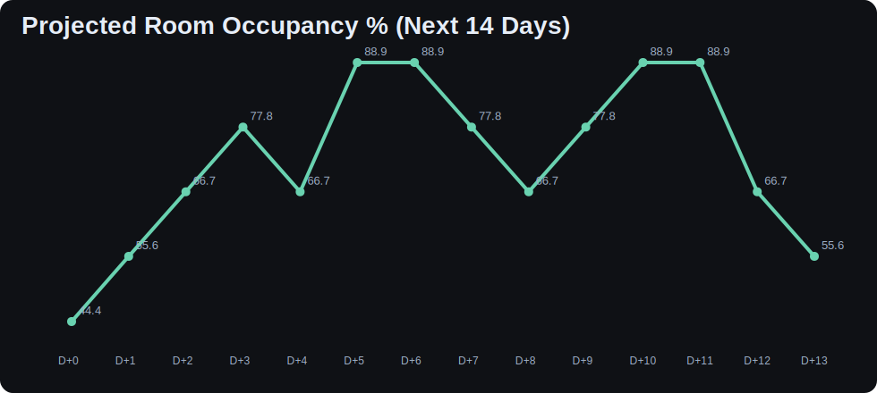

# Chama Station Inn Prototype Presentation Notebook

Use this notebook to present **current prototype value** to the client.

- Audience: owner + operators
- Focus: why this prototype should become the inn's operations PWA foundation

## Property & Brand Framing

- Boutique inn, approximately 9 rooms
- Brand direction: spa-like, calm, premium
- Experience direction: New Mexico-inspired room themes

The charts below are intentionally operator-focused so decision-makers can connect brand promise to operational execution.

### Snapshot

- **Name**: Chama Station Inn

- **Rooms**: 9

- **Brand Direction**: Spa-like, calm, premium

- **Experience Motif**: New Mexico room themes

- **Current Public Site**: https://chamastationinn.com/

## Brand Context Images

**Landing page screenshot not found yet.**  
Expected path: `../assets/landing-page-current.png`

## Pipeline and Data Quality Visuals

    

    

    

    

## Arrival Readiness (48h)

    

    

## 14-Day Occupancy Signal (Demo Projection)

    

    

## Auto-Generated Client Talking Points

1. This prototype already supports operational control, not just website content.

2. Current 48h contact readiness is 75.0%; improving this directly reduces arrival friction.

3. With only 9 rooms, each operational miss has outsized brand impact.

4. WordPress-backed model is stable now and ready for phased PWA workflow lift-out.

## Study Prompts

- Which metric is the fastest confidence win for the owner?
- Which queue should be reviewed first on busy days?
- What language should be swapped in the term mapping workbook?

