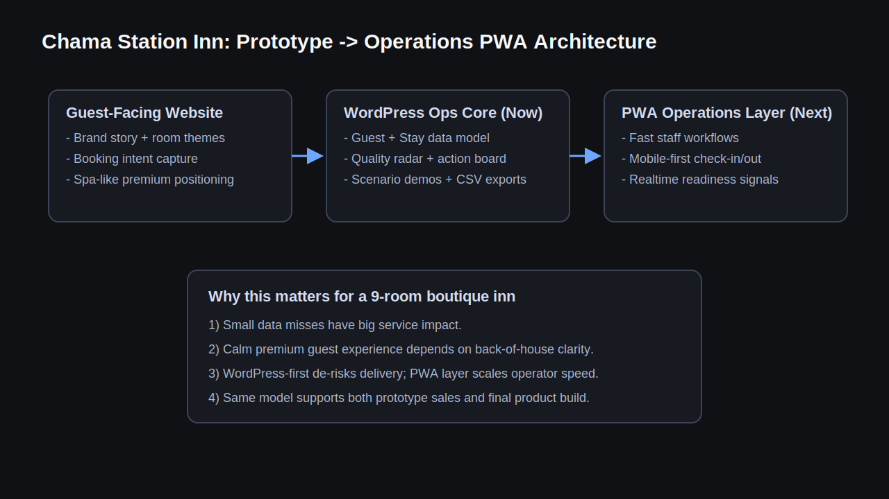
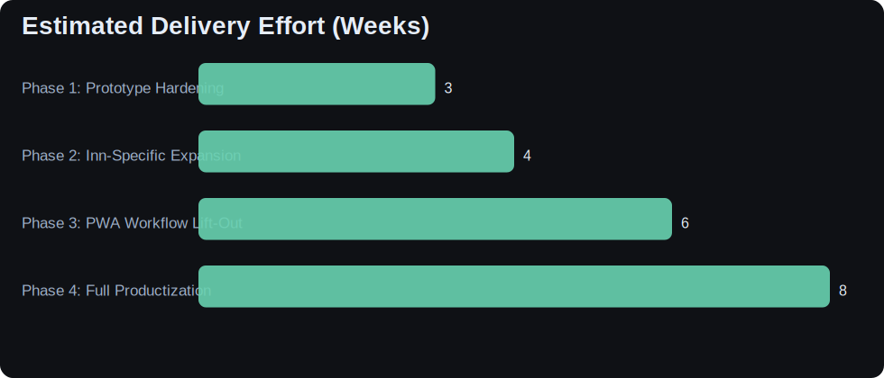
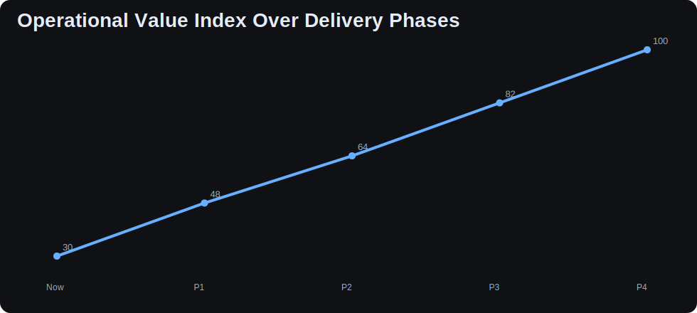
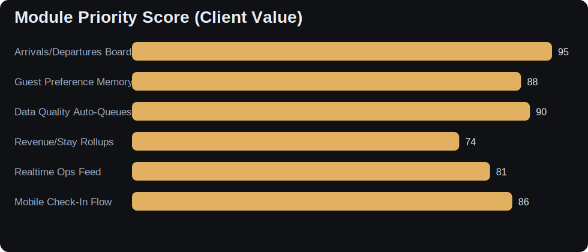

# Chama Station Inn Final App Vision Notebook

Use this notebook to present the **full product direction** after prototype validation.

- Audience: owner + decision-makers
- Focus: phased investment, delivery confidence, and PWA roadmap clarity

## Architecture Direction Image

## Phase Roadmap

    

    

## Business Value Accrual (Illustrative)

    

    

## Module Priority Matrix (Impact-First)

    

    

## Owner Decision Dashboard (Presentation Slide)

### Decision 1
- Approve inn-specific field vocabulary

### Decision 2
- Approve room-theme preference model

### Decision 3
- Approve Phase 2 scope and timeline

### Decision 4
- Approve first PWA workflow module

## Presenter Notes

- Start with risk reduction, not tech novelty.
- Tie each phase to operator pain points the client already recognizes.
- Close on immediate next sprint and owner acceptance criteria.

