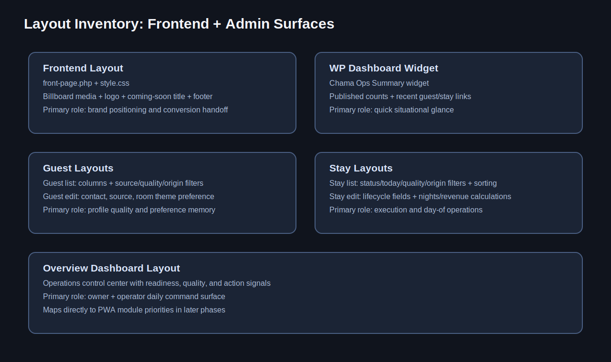

# Layout Deep Dive Notebook (All Layouts)

This notebook explains every major layout surface in the current prototype, including frontend and admin workflows.

## Layout Inventory Map

## Layout-by-Layout Breakdown

### Frontend Landing Layout (Coming-Soon Billboard)

**Primary File / Source**  
`app/public/wp-content/themes/chama-inn/front-page.php`

**Purpose**  
Brand-first entry point while operations platform matures.

**Layout Regions**  
- Billboard media layer
- Overlay for readability
- Centered logo
- Hero title
- Footer legal line

**Customization Targets**  
- Replace Coming Soon with conversion CTA
- Add room-theme storytelling blocks
- Align copy with spa-like positioning

**Screenshot Target**  
`../assets/screenshots/layout-frontend-landing.png`

**Missing Frontend Landing Layout (Coming-Soon Billboard)**

Expected path: `../assets/screenshots/layout-frontend-landing.png`

### WP Dashboard Summary Layout

**Primary File / Source**  
`app/public/wp-content/plugins/chama-ops/chama-ops.php (widget render)`

**Purpose**  
Quick operator orientation at login.

**Layout Regions**  
- Published counts
- Recent guests
- Recent stays

**Customization Targets**  
- Add role-specific quick links
- Tune list lengths for team preference

**Screenshot Target**  
`../assets/screenshots/layout-dashboard-widget.png`

**Missing WP Dashboard Summary Layout**

Expected path: `../assets/screenshots/layout-dashboard-widget.png`

### Guest List Layout

**Primary File / Source**  
`app/public/wp-content/plugins/chama-ops/chama-ops.php (guest columns + filters)`

**Purpose**  
Bulk review and cleanup of guest records.

**Layout Regions**  
- Origin/Email/Phone/Source/VIP columns
- Source filter
- Data quality filter
- Record origin filter

**Customization Targets**  
- Rename labels via term mapping
- Add columns for inn-specific preference taxonomy

**Screenshot Target**  
`../assets/screenshots/layout-guest-list.png`

**Missing Guest List Layout**

Expected path: `../assets/screenshots/layout-guest-list.png`

### Stay List Layout

**Primary File / Source**  
`app/public/wp-content/plugins/chama-ops/chama-ops.php (stay columns + filters)`

**Purpose**  
Execution queue across stay lifecycle.

**Layout Regions**  
- Origin/Guest/Dates/Nights/Status/Revenue columns
- Status filter
- Quality filter
- Today-state filter
- Sortable nights/revenue columns

**Customization Targets**  
- Add SOP state labels
- Introduce role-based saved filter presets

**Screenshot Target**  
`../assets/screenshots/layout-stay-list.png`

**Missing Stay List Layout**

Expected path: `../assets/screenshots/layout-stay-list.png`

### Guest Edit Layout

**Primary File / Source**  
`app/public/wp-content/plugins/chama-ops/chama-ops.php (guest meta box)`

**Purpose**  
Capture reliable guest profile and preference memory.

**Layout Regions**  
- Email + phone
- Source + consent
- Room/theme preference
- VIP flag

**Customization Targets**  
- Map room-theme vocabulary to client terminology
- Add compliance fields if required

**Screenshot Target**  
`../assets/screenshots/layout-guest-edit.png`

**Missing Guest Edit Layout**

Expected path: `../assets/screenshots/layout-guest-edit.png`

### Stay Edit Layout

**Primary File / Source**  
`app/public/wp-content/plugins/chama-ops/chama-ops.php (stay details + linked guest summary)`

**Purpose**  
Track lifecycle state and preserve readiness context.

**Layout Regions**  
- Guest link
- Dates + calculated nights
- Status + revenue
- Linked guest summary side box

**Customization Targets**  
- Add inn-specific operational checkpoints
- Add housekeeping/prep states in future phase

**Screenshot Target**  
`../assets/screenshots/layout-stay-edit.png`

**Missing Stay Edit Layout**

Expected path: `../assets/screenshots/layout-stay-edit.png`

### Overview Dashboard Layout

**Primary File / Source**  
`app/public/wp-content/plugins/chama-ops/chama-ops.php (overview render)`

**Purpose**  
Owner/operator command center.

**Layout Regions**  
- Control row
- Origin snapshot
- Today ops board
- Upcoming arrivals
- Action board
- KPI + quality blocks

**Customization Targets**  
- Reorder blocks by client decision cadence
- Tune recommendation thresholds

**Screenshot Target**  
`../assets/screenshots/layout-overview-dashboard.png`

**Missing Overview Dashboard Layout**

Expected path: `../assets/screenshots/layout-overview-dashboard.png`

## Presenter Sequence (Recommended)

1. Start with frontend landing layout (brand promise).
2. Move to dashboard/overview (operational promise).
3. Show guest + stay list/edit layouts (execution detail).
4. Close by connecting layout stability to phased PWA lift-out.

