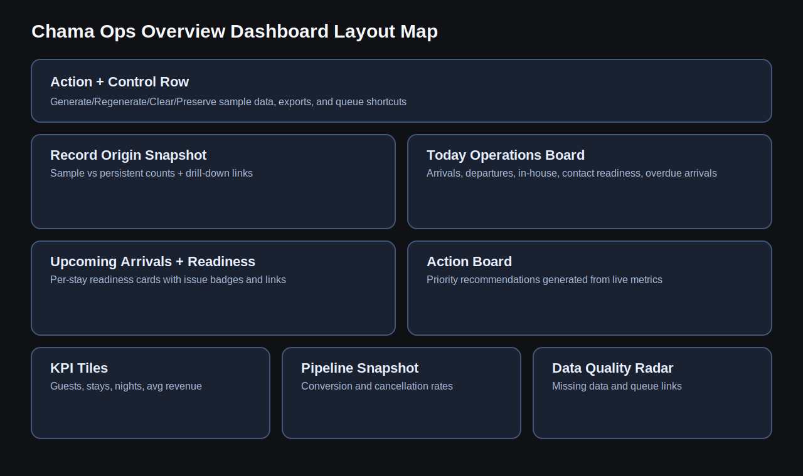

# Partner Progress Report Workbook

Use this print-ready notebook to show exact delivery progress step by step.

## Goal

Give your business partner confidence on:
- what has been built
- why it matters to the client
- what is demo-ready today
- what ships next

## Delivery Snapshot

| Metric | Value |
| --- | --- |
| Total commits (current history) | 43 |
| First commit date | 2026-03-16 |
| Latest commit date | 2026-03-19 |

## Build Phases Completed (by commit activity)

| Phase | Commit Count |
| --- | --- |
| Core Data Model | 12 |
| Dashboard + Insights | 11 |
| Foundation + Platform | 7 |
| Client Presentation Packaging | 5 |
| Demo Data Controls | 5 |
| Operations Readiness | 3 |

## Step-by-Step Commit Timeline

| Step | Date | SHA | Phase | What Changed |
| --- | --- | --- | --- | --- |
| 1 | 2026-03-16 | 9b5cbec | Foundation + Platform | initial commit |
| 2 | 2026-03-16 | 077f2c8 | Foundation + Platform | feat: scaffold custom theme and core plugin |
| 3 | 2026-03-16 | 82cba90 | Foundation + Platform | feat: recreate current homepage shell |
| 4 | 2026-03-18 | 9ece55b | Core Data Model | feat: scaffold chama-ops plugin and register guest and stay models |
| 5 | 2026-03-18 | c98dc8f | Core Data Model | feat: add guest and stay meta boxes |
| 6 | 2026-03-18 | b45f0ac | Core Data Model | feat: add guest and stay admin columns |
| 7 | 2026-03-18 | 054d531 | Dashboard + Insights | feat: add dashboard summary widget for guests and stays |
| 8 | 2026-03-18 | 479b97b | Dashboard + Insights | feat: add chama ops overview dashboard page |
| 9 | 2026-03-18 | 7fe65c2 | Core Data Model | feat: add guest and stay admin filters |
| 10 | 2026-03-18 | a3e1dfc | Dashboard + Insights | feat: add status and source summary cards to overview page |
| 11 | 2026-03-18 | 5abf20b | Dashboard + Insights | feat: add overview quick actions and workflow links |
| 12 | 2026-03-18 | 8a92b21 | Core Data Model | feat: add linked guest summary to stay edit screen |
| 13 | 2026-03-18 | 8469efd | Core Data Model | feat: add related stays summary to guest edit screen |
| 14 | 2026-03-18 | 36b562f | Core Data Model | feat: add stay nights calculation and display |
| 15 | 2026-03-18 | 8a2b835 | Dashboard + Insights | feat: add booked nights and average revenue metrics to overview |
| 16 | 2026-03-18 | 86ac4a8 | Core Data Model | feat: add sortable stay nights and revenue columns |
| 17 | 2026-03-18 | d718988 | Core Data Model | feat: persist stay nights meta for true numeric sorting |
| 18 | 2026-03-18 | 5f810db | Foundation + Platform | feat: add average revenue per night metrics |
| 19 | 2026-03-18 | 7d497ea | Demo Data Controls | chore: document history and add sample-data seed flow |
| 20 | 2026-03-18 | 3d1dbe1 | Demo Data Controls | feat: add demo data regenerate/clear controls and clean admin fallback output |
| 21 | 2026-03-19 | 2e83ec7 | Dashboard + Insights | feat: add data quality radar to overview dashboard |
| 22 | 2026-03-19 | 57e9bbd | Foundation + Platform | feat: add quality queue links and data-quality list filters |
| 23 | 2026-03-19 | 222ea83 | Dashboard + Insights | feat: add pipeline snapshot KPIs and queue links to overview |
| 24 | 2026-03-19 | 7101d6b | Foundation + Platform | feat: add action board with prioritized operational recommendations |
| 25 | 2026-03-19 | 8cc9b14 | Dashboard + Insights | feat: add upcoming arrivals readiness board to overview |
| 26 | 2026-03-19 | 50a8512 | Operations Readiness | feat: add today operations board and same-day stay filters |
| 27 | 2026-03-19 | 32a51c2 | Dashboard + Insights | feat: add secure guest and stay CSV exports from overview |
| 28 | 2026-03-19 | f1913db | Demo Data Controls | feat: make sample data dynamic for realistic ops scenarios |
| 29 | 2026-03-19 | 0696605 | Dashboard + Insights | feat: add demo scenario loaders for overview walkthroughs |
| 30 | 2026-03-19 | f0051b2 | Core Data Model | feat: add one-click stay nights rebuild utility |
| 31 | 2026-03-19 | 4b9c6db | Operations Readiness | feat: add overdue arrivals signal to today operations board |
| 32 | 2026-03-19 | 677a73e | Foundation + Platform | feat: add arrival contact-gap queue for next 48h bookings |
| 33 | 2026-03-19 | d068125 | Core Data Model | feat: auto-format guest phones and add client-facing handoff packet |
| 34 | 2026-03-19 | 896147d | Core Data Model | feat: add room-theme suggestions for guest preferences |
| 35 | 2026-03-19 | ae9d178 | Demo Data Controls | feat: let operators preserve edited sample records |
| 36 | 2026-03-19 | b56600e | Demo Data Controls | feat: add sample-vs-persistent origin visibility in admin lists |
| 37 | 2026-03-19 | 14e1397 | Dashboard + Insights | feat: add record-origin snapshot to overview dashboard |
| 38 | 2026-03-19 | 5bd8cc4 | Operations Readiness | feat: add 48h arrival contact readiness KPI and queue |
| 39 | 2026-03-19 | c810500 | Client Presentation Packaging | docs: add client presentation notebooks with visuals |
| 40 | 2026-03-19 | 7e7d2fc | Client Presentation Packaging | docs: add complete dashboard and layout deep-dive notebooks |
| 41 | 2026-03-19 | 5e3f012 | Client Presentation Packaging | docs: harden client notebooks runtime checks |
| 42 | 2026-03-19 | 9ae43fd | Client Presentation Packaging | docs: execute client notebooks and persist outputs |
| 43 | 2026-03-19 | aa29ffa | Client Presentation Packaging | docs: add results-only github notebook presentation views |

## Demo Evidence To Show Partner

Use these in order during your walkthrough:

### Brand / Experience Intent

### Operations Flow

### Dashboard Map

### Layout Inventory Map

## Partner Talking Script (Print This)

1. We have a working WordPress operations prototype, not just a brochure site.
2. We can demonstrate guest/stay workflows, readiness signals, and action queues.
3. We have client-facing handoff docs and presentation notebooks for decision meetings.
4. We can customize wording (nouns/verbs) quickly per client using term mapping.
5. Next scope extends into restaurant/gift-shop/PWA modules with phased delivery.

## Print Instructions

- In Jupyter/VS Code: run all cells, then export to PDF/HTML for handout.
- On GitHub: open the `.md` export files for code-hidden presentation view.
