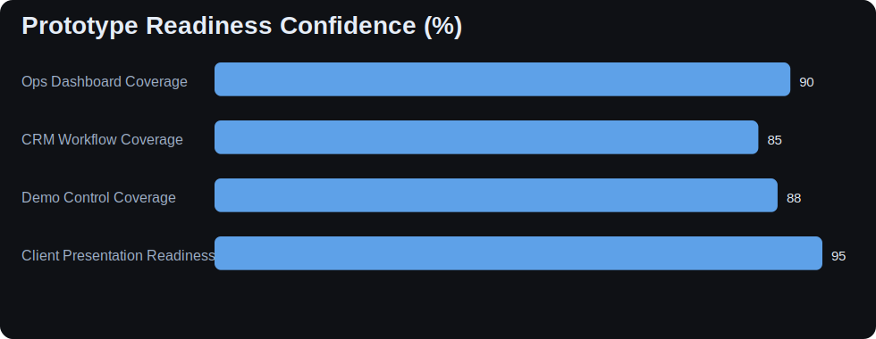

# Client-Ready Progress Brief (Partner Edition)

This version is structured as a leave-behind handout your partner can present to potential clients.

## What Is Already Delivered

- Hospitality CRM base (Guests + Stays)
- Operator-focused dashboard + action board
- Data quality radar and operational readiness KPIs
- Demo data controls and scenario reset flow
- Client handoff docs + presentation notebook system

## Delivery Artifacts Inventory

| Artifact Type | Count |
| --- | --- |
| Client handoff docs | 7 |
| Presentation notebooks | 6 |
| Results-only presentation markdown files | 7 |

## Confidence Indicators for Partner + Client

    

    

## Objection Handling Cheat Sheet

**Objection:** "This is just a website."  
**Answer:** This includes operational queues, quality controls, and readiness KPIs inside admin workflows.

**Objection:** "Can this evolve into a real app?"  
**Answer:** Yes - current structure is staged for PWA extraction while keeping WordPress as operations backend where useful.

**Objection:** "How fast can we customize this to our inn?"  
**Answer:** Fast - term mapping + configurable labels + existing docs make renaming and workflow adaptation straightforward.

## Client Meeting Checklist

1. Show landing page brand direction.
2. Show operations overview dashboard and action board.
3. Show one guest record + one stay record edit flow.
4. Show data quality radar + what issues it prevents.
5. Show delivery roadmap and next-phase options.

## Print Instructions

Export this notebook to PDF/HTML for handout. Also share the markdown export on GitHub for clean code-hidden viewing.
